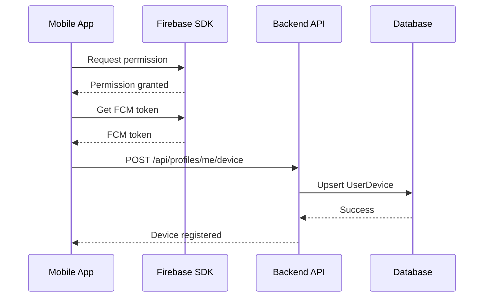
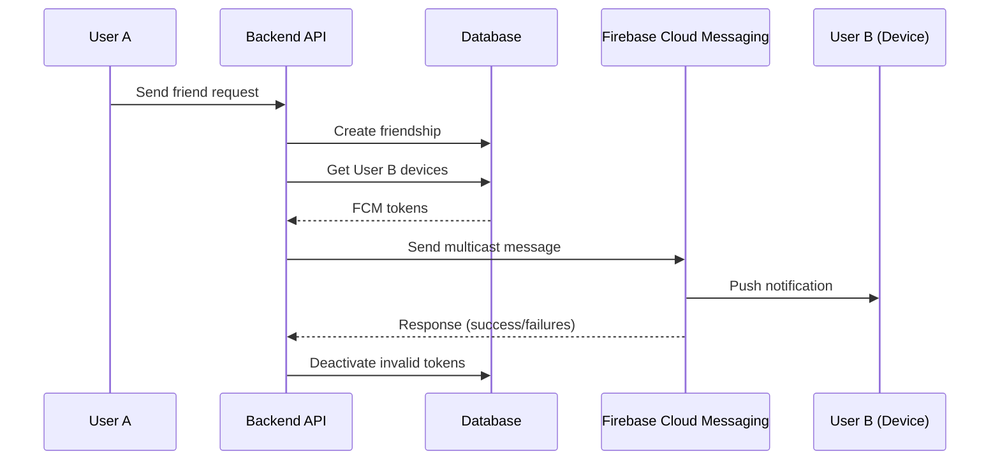

# Módulo 8: Notificações Push com Firebase Cloud Messaging

## Visão Geral

Este módulo implementa um sistema completo de notificações push utilizando Firebase Cloud Messaging (FCM) para enviar notificações em tempo real aos usuários sobre eventos importantes na plataforma.

## Arquitetura do Sistema

```
┌─────────────────────────────────────────────────────────┐
│                   Backend (.NET)                         │
│                                                           │
│  ┌──────────────────────────────────────────────┐       │
│  │         PushNotificationService              │       │
│  │  • SendToUserAsync()                         │       │
│  │  • SendToUsersAsync()                        │       │
│  │  • CleanupInvalidTokens()                    │       │
│  └──────────────────────────────────────────────┘       │
│                    │                                      │
│                    v                                      │
│  ┌──────────────────────────────────────────────┐       │
│  │         FirebaseAdmin SDK                    │       │
│  │  • MulticastMessage                          │       │
│  │  • SendEachForMulticastAsync()               │       │
│  └──────────────────────────────────────────────┘       │
│                    │                                      │
└────────────────────┼──────────────────────────────────────┘
                     │
                     v
          ┌──────────────────────┐
          │  Firebase Cloud      │
          │  Messaging (FCM)     │
          └──────────────────────┘
                     │
                     v
          ┌──────────────────────┐
          │  Mobile Devices      │
          │  (Android/iOS)       │
          └──────────────────────┘
```

## Implementação Backend

### 1. Entidade UserDevice

A entidade `UserDevice` armazena os tokens FCM de todos os dispositivos registrados por usuário:

```csharp
public class UserDevice
{
    public int Id { get; set; }
    public int UserId { get; set; }
    public string FcmToken { get; set; } = string.Empty;
    public string DeviceName { get; set; } = string.Empty;
    public string Platform { get; set; } = string.Empty; // "android", "ios"
    public DateTime CreatedAt { get; set; }
    public DateTime LastUsedAt { get; set; }
    public bool IsActive { get; set; } = true;

    public User User { get; set; } = null!;
}
```

**Características:**
- Suporte para múltiplos dispositivos por usuário
- Token FCM único (índice único no banco)
- Rastreamento de última utilização
- Flag `IsActive` para soft delete
- Platform tracking (Android/iOS)

### 2. Configuração do Firebase Admin SDK

No `Program.cs`, o Firebase Admin SDK é inicializado com as credenciais do projeto:

```csharp
// Firebase Admin SDK initialization
var firebaseCredentialPath = builder.Configuration["Firebase:CredentialPath"]
    ?? "firebase-adminsdk.json";

if (File.Exists(firebaseCredentialPath))
{
    FirebaseApp.Create(new AppOptions
    {
        Credential = GoogleCredential.FromFile(firebaseCredentialPath)
    });
    Console.WriteLine("Firebase Admin SDK initialized successfully.");
}
else
{
    Console.WriteLine($"Warning: Firebase credential file not found at {firebaseCredentialPath}");
    Console.WriteLine("Push notifications will not work until credentials are configured.");
}

builder.Services.AddScoped<IPushNotificationService, PushNotificationService>();
```

**Configuração:**
1. Baixe o arquivo `firebase-adminsdk.json` do console do Firebase
2. Coloque na raiz do projeto ou configure o caminho em `appsettings.json`:
   ```json
   {
     "Firebase": {
       "CredentialPath": "path/to/firebase-adminsdk.json"
     }
   }
   ```

### 3. PushNotificationService

Serviço responsável por enviar notificações via FCM:

```csharp
public interface IPushNotificationService
{
    Task<bool> SendToUserAsync(int userId, string title, string body,
        Dictionary<string, string>? data = null);
    Task<bool> SendToUsersAsync(List<int> userIds, string title, string body,
        Dictionary<string, string>? data = null);
}
```

**Funcionalidades:**
- **SendToUserAsync**: Envia notificação para todos os dispositivos de um usuário
- **SendToUsersAsync**: Envia notificação para múltiplos usuários simultaneamente
- **MulticastMessage**: Envia para até 500 tokens em uma única chamada
- **Cleanup automático**: Desativa tokens inválidos automaticamente

**Exemplo de uso:**
```csharp
await _pushNotificationService.SendToUserAsync(
    userId: 123,
    title: "New Friend Request",
    body: "John wants to be your friend",
    data: new Dictionary<string, string>
    {
        { "type", "friend_request" },
        { "requesterId", "456" },
        { "friendshipId", "789" }
    }
);
```

### 4. Endpoints de Device Management

**Registrar dispositivo:**
```
POST /api/profiles/me/device
Content-Type: application/json
Authorization: Bearer <token>

{
  "fcmToken": "eX1a2b3c4...",
  "deviceName": "iPhone 13 Pro",
  "platform": "ios"
}
```

**Desregistrar dispositivo:**
```
DELETE /api/profiles/me/device?fcmToken=eX1a2b3c4...
Authorization: Bearer <token>
```

**Lógica de registro:**
- Se o token já existe: atualiza o usuário, nome do dispositivo e timestamp
- Se é novo: cria um novo registro
- Sempre marca o dispositivo como ativo

### 5. Eventos que Disparam Notificações

#### Friend Request Enviado
```csharp
// FriendsController.cs - SendFriendRequest
await _pushNotificationService.SendToUserAsync(
    userId,
    "New Friend Request",
    $"{requesterName} wants to be your friend",
    new Dictionary<string, string>
    {
        { "type", "friend_request" },
        { "requesterId", currentUserId.ToString() },
        { "friendshipId", friendship.Id.ToString() }
    }
);
```

**Quando:** Usuário envia pedido de amizade
**Destinatário:** Usuário que recebeu o pedido
**Dados:** requesterId, friendshipId

#### Friend Request Aceito
```csharp
// FriendsController.cs - AcceptFriendRequest
await _pushNotificationService.SendToUserAsync(
    friendship.RequesterId,
    "Friend Request Accepted",
    $"{addresseeName} accepted your friend request",
    new Dictionary<string, string>
    {
        { "type", "friend_request_accepted" },
        { "friendId", currentUserId.ToString() }
    }
);
```

**Quando:** Usuário aceita pedido de amizade
**Destinatário:** Usuário que enviou o pedido original
**Dados:** friendId

#### Collection Compartilhada
```csharp
// CollectionsController.cs - ShareCollection
var ownerName = collection.Owner.Profile?.DisplayName ?? collection.Owner.Username;
await _pushNotificationService.SendToUserAsync(
    request.SharedWithUserId,
    "Collection Shared",
    $"{ownerName} shared \"{collection.Title}\" with you",
    new Dictionary<string, string>
    {
        { "type", "collection_shared" },
        { "collectionId", collectionId.ToString() },
        { "ownerId", userId.ToString() },
        { "canEdit", request.CanEdit.ToString() }
    }
);
```

**Quando:** Usuário compartilha uma coleção
**Destinatário:** Usuário que recebeu o compartilhamento
**Dados:** collectionId, ownerId, canEdit

## Banco de Dados

### Migration

```bash
# Criar migration
dotnet ef migrations add AddUserDevices --project backend/LinkShare.API

# Aplicar ao banco
dotnet ef database update --project backend/LinkShare.API
```

### Schema da Tabela UserDevices

```sql
CREATE TABLE UserDevices (
    Id INT PRIMARY KEY IDENTITY(1,1),
    UserId INT NOT NULL,
    FcmToken NVARCHAR(500) NOT NULL UNIQUE,
    DeviceName NVARCHAR(200),
    Platform NVARCHAR(50),
    CreatedAt DATETIME2 NOT NULL,
    LastUsedAt DATETIME2 NOT NULL,
    IsActive BIT NOT NULL DEFAULT 1,
    FOREIGN KEY (UserId) REFERENCES Users(Id) ON DELETE CASCADE
);

CREATE UNIQUE INDEX IX_UserDevices_FcmToken ON UserDevices(FcmToken);
```

## Fluxo de Notificações

### 1. Registro do Dispositivo



### 2. Envio de Notificação



## Tratamento de Erros

### Tokens Inválidos

O serviço automaticamente desativa tokens que falharam ao enviar:

```csharp
// Identificar tokens inválidos
var invalidTokens = response.Responses
    .Select((r, index) => new { Response = r, Index = index })
    .Where(x => !x.Response.IsSuccess)
    .Select(x => tokens[x.Index])
    .ToList();

// Desativar no banco de dados
if (invalidTokens.Any())
{
    var devicesToDeactivate = await _context.UserDevices
        .Where(d => invalidTokens.Contains(d.FcmToken))
        .ToListAsync();

    foreach (var device in devicesToDeactivate)
    {
        device.IsActive = false;
    }

    await _context.SaveChangesAsync();
}
```

### Erros Comuns

| Erro | Causa | Solução |
|------|-------|---------|
| `Credential file not found` | firebase-adminsdk.json ausente | Baixar do Firebase Console |
| `Invalid token` | Token FCM expirado/inválido | Auto-cleanup no envio |
| `Authentication error` | Credenciais incorretas | Verificar arquivo JSON |
| `Quota exceeded` | Limite de envios excedido | Verificar plano Firebase |

## Segurança

### Autenticação

Todos os endpoints de device management requerem autenticação JWT:

```csharp
[Authorize]
[HttpPost("me/device")]
public async Task<ActionResult> RegisterDevice([FromBody] RegisterDeviceDto deviceDto)
```

### Validação de Propriedade

- Usuários só podem registrar dispositivos para si mesmos
- Usuários só podem desregistrar seus próprios dispositivos
- Tokens FCM são únicos e vinculados a um usuário por vez

### Dados Sensíveis

- Tokens FCM são armazenados de forma segura no banco
- Notificações não devem conter informações sensíveis no corpo
- Informações detalhadas devem ser enviadas no campo `data` e processadas pelo app

## Monitoramento e Logs

### Logs do Sistema

```csharp
Console.WriteLine("Firebase Admin SDK initialized successfully.");
Console.WriteLine($"Notification sent successfully to {response.SuccessCount}/{tokens.Count} devices");
Console.WriteLine($"Deactivated {devicesToDeactivate.Count} invalid device tokens");
```

### Métricas Importantes

- **Taxa de sucesso**: `response.SuccessCount / tokens.Count`
- **Tokens inválidos**: Quantidade de tokens desativados automaticamente
- **Dispositivos ativos por usuário**: Média de devices por user
- **Taxa de entrega**: Monitorar no Firebase Console

## Configuração do Firebase Console

### Passos para Setup

1. **Criar projeto no Firebase Console**
   - Acesse https://console.firebase.google.com
   - Crie um novo projeto ou use existente

2. **Adicionar aplicativos Android/iOS**
   - Registre o bundle ID (iOS) ou package name (Android)
   - Baixe google-services.json (Android) ou GoogleService-Info.plist (iOS)

3. **Gerar credenciais de servidor**
   - Project Settings > Service Accounts
   - Clique em "Generate new private key"
   - Salve como `firebase-adminsdk.json`

4. **Configurar Cloud Messaging**
   - Habilite Cloud Messaging API no Google Cloud Console
   - Configure sender ID e server key (legado, se necessário)

## Próximos Passos (Mobile)

A implementação mobile do FCM incluirá:

1. **Instalação de pacotes Flutter:**
   ```yaml
   dependencies:
     firebase_core: ^2.24.0
     firebase_messaging: ^14.7.6
   ```

2. **Inicialização do Firebase:**
   ```dart
   await Firebase.initializeApp();
   ```

3. **Solicitação de permissões:**
   ```dart
   NotificationSettings settings = await messaging.requestPermission();
   ```

4. **Obtenção do token FCM:**
   ```dart
   String? token = await FirebaseMessaging.instance.getToken();
   ```

5. **Handlers de notificação:**
   - Foreground: `FirebaseMessaging.onMessage`
   - Background: `FirebaseMessaging.onBackgroundMessage`
   - App terminado: `getInitialMessage()`

**Nota:** A implementação Flutter será realizada após o usuário configurar os arquivos do Firebase (google-services.json / GoogleService-Info.plist).

## Testando o Sistema

### Teste Manual via API

```bash
# 1. Registrar dispositivo (use um token FCM real do emulador/device)
curl -X POST http://localhost:5000/api/profiles/me/device \
  -H "Authorization: Bearer YOUR_JWT_TOKEN" \
  -H "Content-Type: application/json" \
  -d '{
    "fcmToken": "REAL_FCM_TOKEN_HERE",
    "deviceName": "Test Device",
    "platform": "android"
  }'

# 2. Enviar pedido de amizade (dispara notificação)
curl -X POST http://localhost:5000/api/friends/request \
  -H "Authorization: Bearer YOUR_JWT_TOKEN" \
  -H "Content-Type: application/json" \
  -d '{
    "friendUsername": "testuser"
  }'
```

### Verificação de Logs

Verifique os logs do backend para confirmar o envio:
```
Firebase Admin SDK initialized successfully.
Notification sent successfully to 1/1 devices
```

## Referências

- [Firebase Admin SDK for .NET](https://firebase.google.com/docs/admin/setup)
- [Firebase Cloud Messaging](https://firebase.google.com/docs/cloud-messaging)
- [FCM Multicast Messages](https://firebase.google.com/docs/cloud-messaging/send-message#send-messages-to-multiple-devices)
- [FirebaseAdmin NuGet Package](https://www.nuget.org/packages/FirebaseAdmin/)

## Conclusão

O Módulo 8 implementa um sistema robusto de notificações push que:

✅ Suporta múltiplos dispositivos por usuário
✅ Envia notificações para eventos importantes (amizades, compartilhamentos)
✅ Faz cleanup automático de tokens inválidos
✅ É seguro e autenticado via JWT
✅ Utiliza MulticastMessage para eficiência
✅ Está pronto para integração com o app Flutter

O sistema está totalmente configurado no backend e aguarda apenas a configuração dos arquivos do Firebase e implementação mobile para estar operacional.
